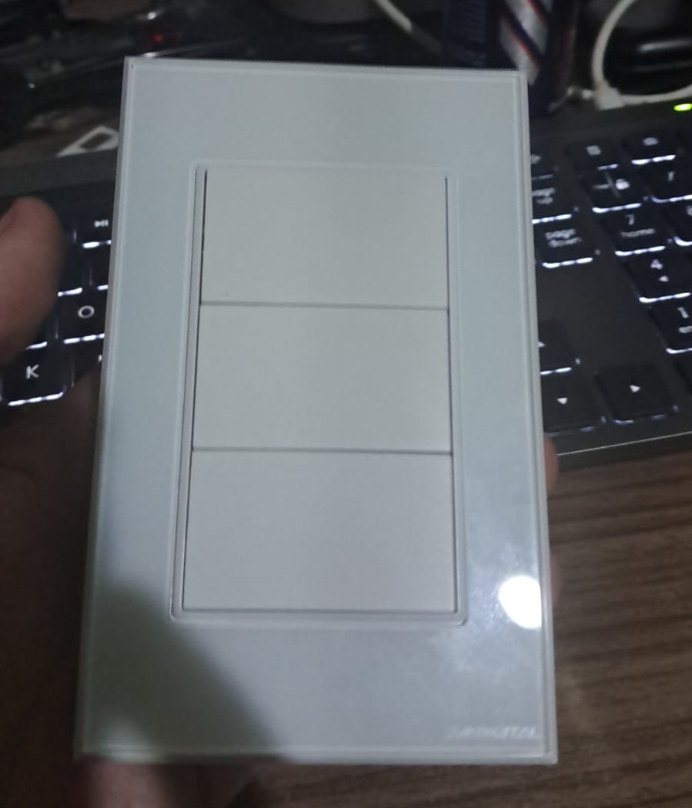

# Findings

## 2024/03/16

Today I tested the novadigital NZ3 a 3 button physical switch, each switch has a line out for powering devices, with a max of 150w per channel, should be plenty for powering lights and the spots I plan to put. 
It is a rebrand of a tuya zigbee enabled device. Results were pretty good. I discovered that, they don´t have to be paired to a zigbee device, they will default to behave as a normal switch, so button 1 will control L1, button 2 will control L2 and so on.

## 2024/03/23

As zigbee2mqtt is very buggy on my setup, I decided to abandon its usage and will instead use home assistant own zigbee integration. It is very good as well.
